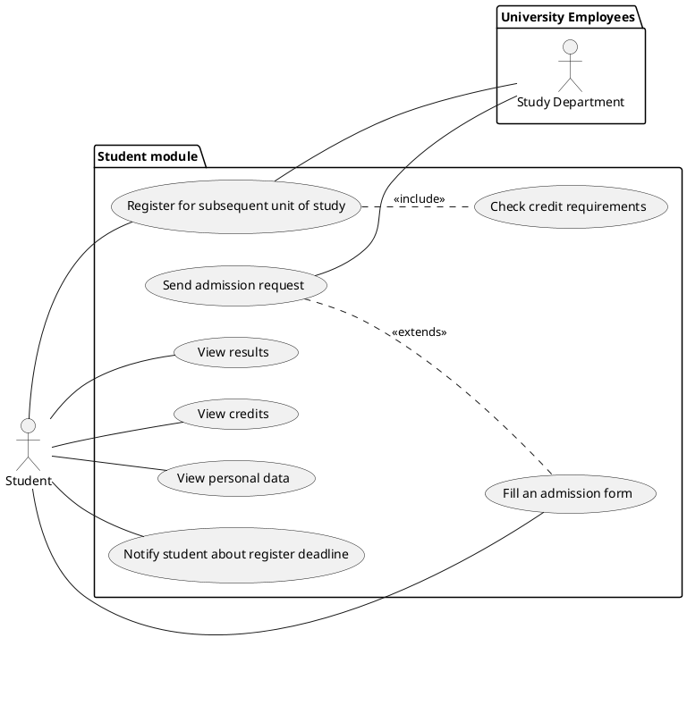
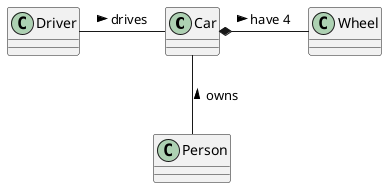

# Student information system - [Students]

The module Students is used to manage admission procedures, enrollment of students in their studies at the university, the courses they're enrolled in with the results in these courses and results of their final state exams.

The module enables to create individual admission procedures for individual study programs and years and to record the results of the admission procedures for individual participants. For admitted students, it is then necessary to record whether they enrolled to the studies by enrolling before the start of the first academic year.

During the studies, the results of seminars and exams and credits obtained for individual successfully completed courses are recorded. Furthermore, the module enables to manage results of defenses of diploma and bachelor's theses and state final examinations. Students are able to view their own results, credits and personal details.

Students are able to register for subsequent unit of their study program according to University specification. Students must meet required number of credits and the module needs to check if this condition is met. Students should be notified about the register deadline. 

The module also allows users to create statistical reports on the student success rate in each year. 

## Functional Requirements

This section specifies the functional requirements.

### User requirements

#### Students

- MUSTR: WHO - WHAT - WHY **TODO**
- EXAMPLE: - As a Student I should be able to view my exam results because I need to have my results gathered at one place

- Students should be able to fill an admission form and send the admission request to the study department.
- Students should be able to view their credits.
- Students should be able to view their personal details.
- Students should be able to register for subsequent unit of their study program according to the University specification.
- The module should automatically notify the students about the deadline for registering for subsequent unit of their study program.

#### Study department

- The study department should be able to create individual admission procedures for individual study programs and years based on the admission forms from the students.
- The study department should be able to record the results of the admission procedures for individual participants.
- The study department should be able to record whether admitted students enrolled to the studies by enrolling before the start of the first academic year.
- The module must be able to automatically check whether the students meet required number of credits. If the student does not meet the requirements, he is informed via a notification. The study department is notified as well.

#### Teachers

- Teachers record the results of seminars and exams and credits obtained for individual successfully completed courses. The data for this are available from the Exams module.
- Teachers must be able to manage the results of defenses of diploma and bachelor's theses and state final examinations. This cooperates with the Theses module.

#### All users

- Any user of the system is able to view statictics of the study programmes including student success rates.

### System requirements

#### Actors

- Students
- Study department
- Teachers
- All users

##### Students

A student is a person studying at the university. They can send admission request. They are able to view their personal results and their credits obtained in subjects. They can register for subsequent unit of their study program.

##### Study department

The study department manages admission procedures and records whether admitted students enrolled. The study department is notified about the students' registrations for subsequent units of their study programs. 

##### Teachers

A teacher is an employee of the university. They are responsible for grading the students. They may edit the students' exams and theses results.

##### All users

This represents any of the previous actors including any other person having access to the system (e.g. public visitors).

#### Use cases

##### Students

**General precondition**
For each use case, we assume that the respective actor has verified themselves and is successfully authorized.

###### Use case - signup for subsequent unit of study

**Precondition**
- The student has to go to the website where they register for subsequent unit of their studies.

**Normal flow**
1. The student tells the system they want to register for subsequent unit of their study program.
2. The system checks whether the student meets all criteria for registering. Credits need to be checked for this in order to check that requirements are met.
3. The student is informed about the successful check.
4. The student signs up for subsequent unit of study. The study department is informed about the registration as well.

**What can go wrong (alternative scenarios)**
- In the second point, the student could not meet the criteria for the registration. Then the following happens:
  3. The student informed about the unsuccessful check. They may not register for subsequent unit of study.

**Postcondition**
- The system has recorded the student's for subsequent unit of study. Both the student and the study department are notified.

**TODO: každý udělat 2 scénáře**

###### Use case - fill admission form

1. Student fills out the admission formular.
2. Student tries to send the admission formular to the study department through the module.
3. Server gets a request to send the formular.
4. Server checks if the admission formular is filled out. 
5. If this condition is met, the formular gets sent to the Study Department.
6. If the condition is not met, student is notified to fill out the formular.

###### Use case - view results

1. Student wants to view his study results.
2. The server recieves a request to return the student's results.
3. The results are shown to the student.

###### Use case - view credits

1. Student wants to view his credits
2. Student clicks on button which sends a request to the server
3. Student is displayed his credit count
4. Student can filter years and semesters by using another button

###### Use case - view personal data

1. Student wants to view his personal data
2. Student clicks on button which sends a request to the server
3. Student is displayed his personal data

##### Study department

- TODO: add diagrams

##### Teachers

- TODO: add diagrams

---

## Information model

**TODO: this**

[*Express the information model of the domain as a UML class diagram in PlantUML. Do not use class methods in the diagram, only classes, class attributes and associations connecting classes.*]

[*Document each class with a short description in a separate subsection*]

### [*Class name*]

[*Class description*]