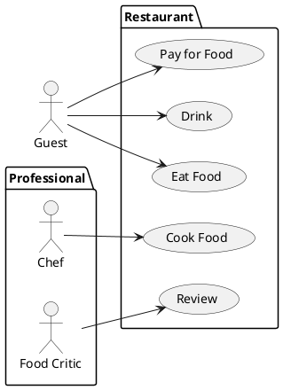
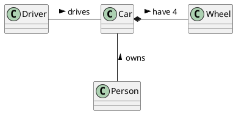

# Student information system - Module Students

**TODO: edit this, currently just copied from the original description**

The module Students is used to manage admission procedures, enrollment of students in their studies at the university, their completed courses with the results in that courses and results of their final state exams. The module enables to create individual admission procedures for individual study programs and years and to record the results of the admission procedures for individual participants. For admitted students, it is then necessary to record whether they enrolled to the studies by enrolling before the start of the first academic year. During the studies, the results of seminars and exams and credits obtained for individual successfully completed courses are recorded. Furthermore, the module enables to manage results of defenses of diploma and bachelor's theses and state final examinations. The module also allows users to create statistical reports on the student success rate in each year.

## Functional Requirements

This section specifies the functional requirements.

### User requirements

[**TODO:** *List of user requirements*]

### System requirements

[**TODO:** *Document here your system requirements as use case diagrams.*]

#### Actors

[**TODO:** *Document here all actors from the use case diagrams. Make a subsection for each actor and their short description in each subsection.*]

##### [*Actor name*]

[**TODO:** *Actor description*]

#### Use cases

[**TODO:** *Document here all use cases. Create a subsection for each use case diagram. If you have only one use case diagram, you do not need a special subsection*]

##### [*Use case diagram title*]

[**TODO:** *Use case diagram in PlantUML*]

To be able to embed PlantUML diagrams to Markdown code with previews in VSCode you need
* Markdown All in One extension
* PlantUML extension
* Mardown Plantuml Preview extension

Follow https://plantuml.com/

[*Describe the diagram in a short paragraph. Describe each use case from the diagram in the detail from the lecture in a separate subsection.*]

###### [*Use case title*]

**TODO:**

[*Use case description in the structure from the lecture.*]

[*Add an activity diagram for one use case per a team member*]

## Information model

[**TODO (not needed for the second meeting):** *Express the information model of the domain as a UML class diagram in PlantUML. Do not use class methods in the diagram, only classes, class attributes and associations connecting classes.*]

[*Document each class with a short description in a separate subsection*]

### [*Class name*]

[**TODO (not needed for the second meeting):** *Class description*]