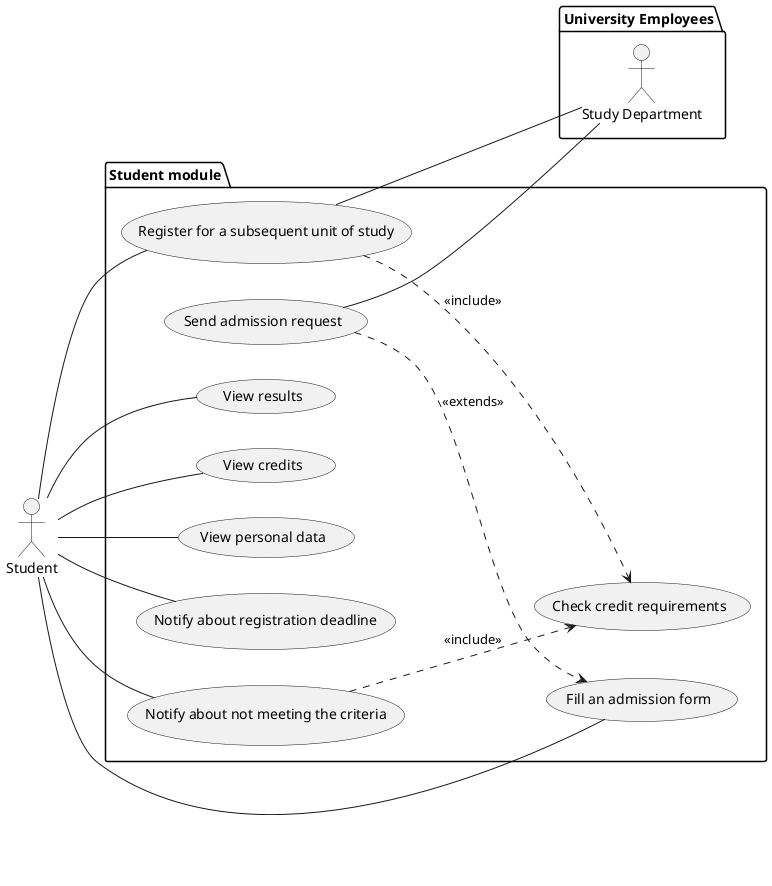
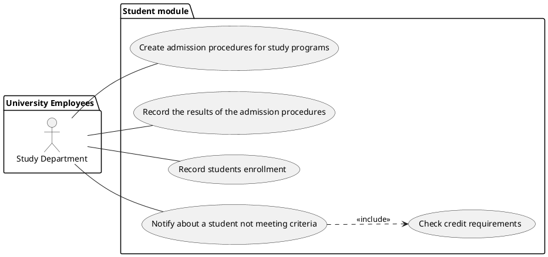
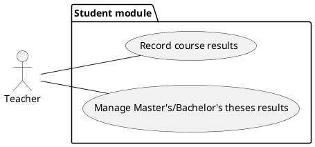
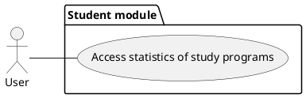
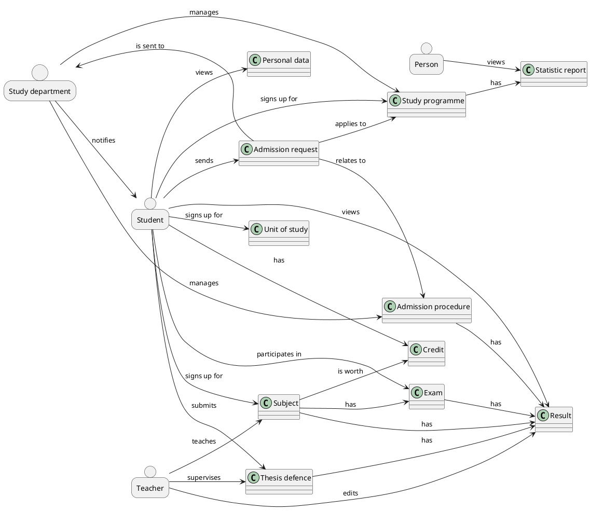

# Student information system - [Students]

The module Students is used to manage admission procedures, enrollment of students in their studies at the university, the courses they're enrolled in with the results in these courses and results of their final state exams.

The module enables to create individual admission procedures for individual study programs and years and to record the results of the admission procedures for individual participants. For admitted students, it is then necessary to record whether they enrolled to the studies by enrolling before the start of the first academic year.

During the studies, the results of seminars and exams and credits obtained for individual successfully completed courses are recorded. Furthermore, the module enables to manage results of defenses of diploma and bachelor's theses and state final examinations. Students are able to view their own results, credits and personal details.

Students are able to register for subsequent units of study according to the University specification. Students must meet required number of credits and the module needs to check if this condition is met. Students should be notified about the registration deadline. 

The module also allows users to create statistical reports on the student success rate in each year. 

## Functional Requirements

This section specifies the functional requirements.

### User requirements

#### Students

- As a Student, I should be able to view my exam results because I need to have my results gathered at one place.
- As a Student, I should be able to fill in an admission form, because I want to sign up for the study program.
- As a Student, I should be able to send the admission request to the study department, because I want the study department to receive my request.
- As a Student, I should be able to view my total credits, so that I can check whether or not I have enough credits for enrolling into the subsequent unit of study.
- As a Student, I should be able to view my personal details, so that I can check their correctness.
- As a Student, I should be able to register for a subsequent unit of study according to the University specification, so that I can continue studying.
- As a Student, I want to be notified if I don't meet the requirements for registration for subsequent unit of study, because I need to know whether I have to complete more courses or exams.
- As a Student, I want to be notified about the deadline for registration for subsequent unit of study, because I want to continue with my studies.

#### Study department

- As the Study department, we should be able to create individual admission procedures for individual study programs and years, because every program is different and has different requirements on different qualities of the students.
- As the Study department, we should be able to record the results of the admission procedures for individual participants, so that we can decide who will be accepted.
- As the Study department, we should be able to record whether admitted students enrolled to the studies by enrolling before the start of the first academic year, because the University specification says, that the admitted students can enroll only before the start of the first academic year.
- As the Study department, we should be notified if the student does not meet the criteria for signing up for the subsequent unit of study, because in that case we want to get in touch with them.

#### Teachers

- As a Teacher, I should be able to record the results of the seminars and exams for individual courses, because the students need to know their course and exam results. The data for this are available from the Exams module.
- As a Teacher, I must be able to manage the results of defenses of master's and bachelor's theses and final state examinations. This cooperates with the Theses module. As a teacher I need this, because it is my responsibility to grade the student's work. 

#### All users

- As any user, I should be able to access statistics of the study programmes including student success rates, because they should be public.

### System requirements

#### Actors

- Students
- Study department
- Teachers
- All users

##### Students

A student is a person studying at the university. They can send admission requests. They are able to view their personal results and credits gained in individual courses. They can register for a subsequent unit of study.

##### Study department

The study department manages admission procedures and records whether admitted students enrolled or not. The study department also wants the module to be able to automatically check whether the students meet required number of credits.

##### Teachers

A teacher is an employee of the university. They are responsible for grading the students. They may edit the students' exams and theses results.

##### All users

This represents any of the previous actors including any other person having access to the system (e.g. public visitors).

#### Use cases

##### A general precondition:
For each use case, we assume that the respective actor has verified themselves and is successfully authorized.

##### Students

###### Use case - Register for subsequent unit of study

**Precondition:**

The student goes to the website where they register for subsequent unit of study.

**Normal flow:**
1. The student wants to register for subsequent unit of study.
2. The module checks whether the student meets all criteria (credits) for signing up.
3. The student is notified that the check was successful.
4. The student confirms the registration.
5. The study department is informed about the registration.

**What can go wrong:**

a) Student does not meet the criteria.

3. The student is notified that they do not meet the criteria.
4. The student cannot confirm the registration.

**Postcondition:**

The student is registered for subsequent unit of study.

###### Use case - Fill an admission form

**Precondition:**

The student goes to the website with the admission form to fill in.

**Normal flow:**

1. The student fills in all required fields.
2. The module checks whether the data conforms to the criteria.
3. The student sends the completed admission form.
4. The study department is notified about a new student admission. 

**What can go wrong:**

a) The student does not fill in all information.

3. The student is notified that they need to fill in the required information. Until then, they are not able to send the admission. We return to the point number 2.

b) The student enters invalid information.

3. The student is notified that they entered an invalid value. They are not able to send the admission until they enter a valid value. We return to the point number 2.

**Postcondition:**

The student has successfully sent the admission form and the study department knows about the admission.

###### Use case - View exam results

**Precondition:**

The student goes to the website where they view their study results.

**Normal flow:**
1. The student wants to view their study results.
2. The module is asked to provide the student's results.
3. The results are shown to the student.

**Postcondition:**

The student is shown their study results.

###### Use case - view credits

**Precondition:**

The student goes to the website where they view their credits.

**Normal flow:**
1. The student wants to view their credits.
2. The module is asked to provide the student's credits.
3. The student is displayed their credit count.
4. The student can see each year's and semester's credit count.

**Postcondition:**

The student is shown their credits.

###### Use case - view personal data

**Precondition:**

The student goes to the website where they view their personal data.

**Normal flow:**
1. The student wants to view his personal data.
2. The module is asked to provide the student's personal data.
3. Student is displayed his personal data.

**Postcondition:**

The student is shown their personal data.

##### Study department

###### Use case - Create admission procedures for study programs

**Precondition:**

The study department goes to a website, where they can create admission procedures for study programs.

**Normal flow:**

1. The study department fills out a formular for creating an admission procedure.
2. The study department sends the formular to the module.
3. The module starts the admission procedure according to the formular filled out by the study department.
4. The module notifies the study department that the admission procedure had started.

**What can go wrong:**

a) The study department does not fill all required information for creating an admission procedure.

3. The module informs the study department to fill all required information.

**Postcondition:**

An admission procedure for given study program is started.

###### Use case - Record the results of the admission procedures

**Precondition:**

The study department goes to a website, where they record the results of the admission procedures

**Normal flow:**

1. The study department enters information about the results of the admission procedures.
2. The study department sends the entered information to the module.
3. The module stores the information.
4. The module notifies the study department that the information was stored successfully.

**What can go wrong:**

a) The study department enters information in wrong format.

3. The module notifies the study department that they had entered information in wrong format.

**Postcondition:**

The results of the admission procedures are stored.

###### Use case - Record students enrollment

**Precondition:**

The study department goes to a website, where they can record the students enrollment

**Normal flow:**

1. The study department enters information about the student and his enrollment
2. The study department sends the entered information to the module.
3. The module stores the information.
4. The module notifies the study department that the information was stored successfully.

**What can go wrong:**

a) The study department enters incorrect information (e.g., The students enrollment is incompatible with study program of the student).

3. The module notifies the study department that they had entered incorrect information.

**Postcondition:**

The students enrollment is stored.

##### Teachers

###### Use case - Record course results

**Precondition:**

The teacher goes to the website page where they enter students' course results.

**Normal flow:**
1. The teacher navigates to the course they want to record results for.
2. The module presents the teacher with a list of students enrolled in the course.
3. The teacher selects the student whose results they want to record.
4. The module displays a form that allows the teacher to select the grade or to award a credit.
5. The teacher selects the correct grade or awards the student with a credit.
6. The teacher saves the results.
7. The module confirms that the results have been saved successfully.

**What can go wrong:**

a) The teacher does not select a grade.
3. The module notifies the teacher that no grades could have been saved.

**Postcondition:**

The course results are recorded in the module.

#### All users

###### Use case - Access statistics of study programs

**Precondition:**

The user goes to the course statistics website.

**Normal flow:**
1. The module presents the user with a list of study programs.
2. The user selects the study program they want to view statistics for.
3. The module displays statistics of the study program, such as
    - number of enrolled students
    - number of students that successfully completed the course
    - the average grade

**Postcondition:**
None

---

## Information model

### Person
Any user of the system, including visitors.

### Student
A person enrolled in the studies.

### Teacher
A person teaching the subjects and evaluating students.

### Study department
An organization responsible for managing students, teachers, admissions, statistics, results, their activities and relations between them.

### Subject
A part of a study programme taught by a teacher.

### Credit
A point assigned for subjects. A certain amount is necessary for finishing the studies and registering for a subsequent unit of study. 

### Result
An evaluation of subjects, exams, thesis defenses and admission procedures which decides whether credits are assigned and whether studies can be finished. 

### Unit of study
A part of study which provides space for finishing subjects and requires credits to sign up for.

### Bachelor's/master's thesis defense
Decides result of Bachelor's and master's thesis which is neccesary for finishing study programmes.

### Study programme
A set of subjects and thesis which a student has to finish in order to get a degree in specific field of study.

### Admission procedure
Steps which have to be completed in order to be able to enroll for a specific study programme.

### Admission request
A formal request to undergo the admission procedure.

### Statistics report
Statistics containing information about success rates of students in each year in all study programmes.