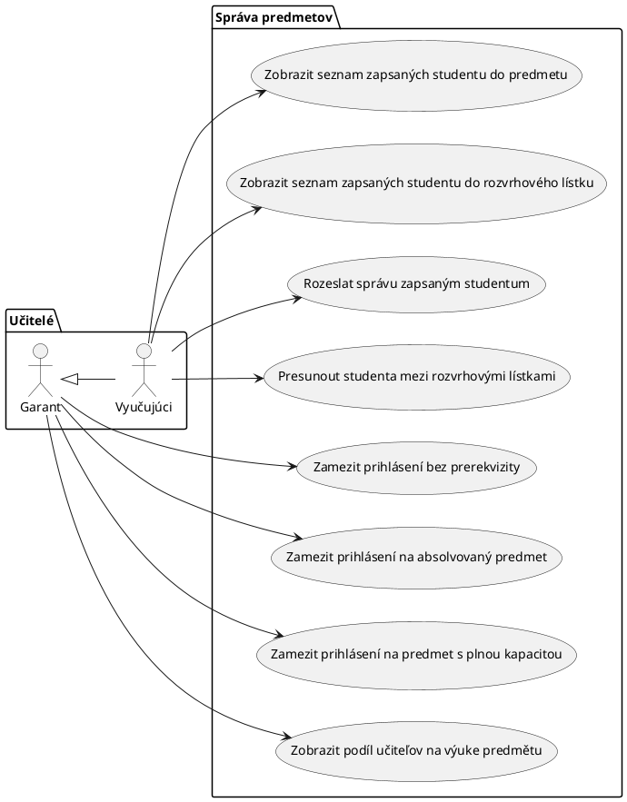
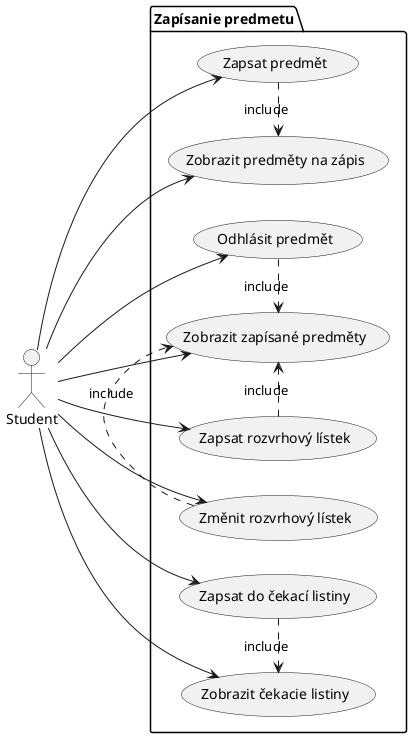
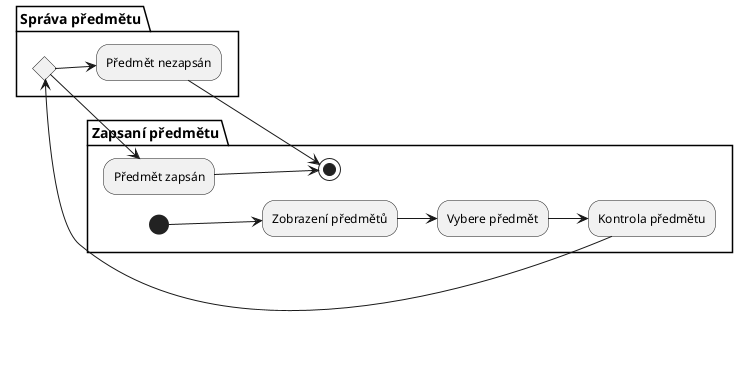
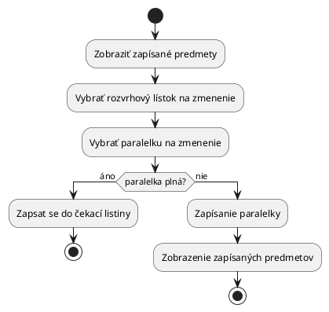
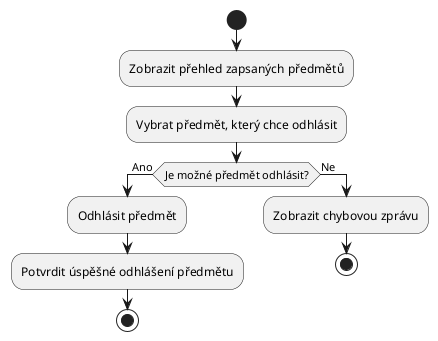
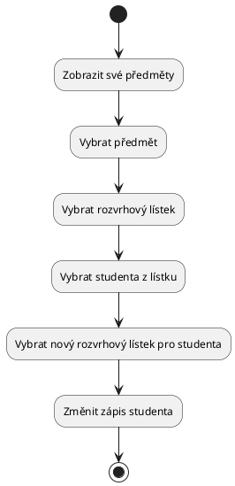
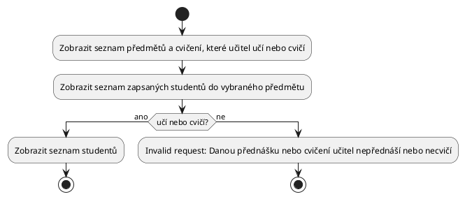
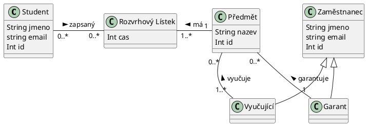

# Student information system - Modul zápisy

Modul zápisy slouží k zapisování studentů do předmětů v semestrech a k zápisu na konkrétní rozvrhové lístky předmětu v rozvrhu na daný semestr. Zápis do lístku s naplněnou kapacitou je možný do čekací listiny předmětu.
Student se nemůže zapsat na předmět, který má jako prerekvizitu předmět, který ještě úspěšně neabsolvoval. Dále se nemůže zapsat na předmět, který již absolvoval, pokud nemá předmět explicitně povoleny opakované zápisy.
Garanti předmětu a vyučující přiřazení k jednotlivým rozvrhovým lístkům mohou vidět seznam studentů zapsaných do předmětu i na jednotlivé rozvrhové lístky a mohou jim rozesílat zprávy. Dále mohou studenty přesouvat mezi rozvrhovými lístky.
Modul umožňuje vytvářet statistické reporty o počtech studentů zapsaných do předmětů a do rozvrhových lístků v jednotlivých semestrech a o podílech učitelů na výuce.

## Functional Requirements

This section specifies the functional requirements.

### User requirements

- Jako student chci být schopen si zapsat předmět, abych ho mohl absolvovat.
- Jako student chci být schopen si odhlásit předmět, abych ho nemusel absolvovat.
- Jako student chci být schopen si zapsat rozvrhový lístek předmětu, abych si ho mohl rozvrhnout.
- Ako študent chcem byť schopný si zmeniť rozvrhový lístok predmetu, aby som si vylepšil rozvrh.
- Jako student chci být schopen se zapsat do čekací listiny, pokud je předmět plný, abych byl přihlášen, když se uvolní místo.
- Ako študent chcem mať prehľad o čakacích listín v ktorých som zapísaný, aby som vedel, či si mám zmeniť dané rozvrhové lístky.
- Jako student chci mít přehled o zapsaných předmětech, abych si je mohl odhlásit.
- Jako student chci vidět předměty, které si jsem schopen přihlásit, abych si je mohl přihlásit.

- Jako garant chci zamezit přihlášní studentů do předmětu, pro které nemají splněné prerekvizity, aby dodržoval školní řád.
- Jako garant chci zamezit přihlášní studentů do předmětu, které již absolvovali, pokud nemá předmět explicitně povoleny opakované zápisy, aby bylo místo pro nové studenty.
- Jako garant chci zamezit přihlášní studentů do předmětu, které mají plnou kapacitu, aby se vešli do učebny.
- Ako garant chcem vidieť podieľ rôznych učiteľov na výuke predmetu, aby som o nich mal prehľad.

- Jako garant/vyučijící chci vidět seznam studentů zapsaných do předmětu, abych o nich měl přehled.
- Jako garant/vyučijící chci vidět seznam studentů zapsaných do rozvrhových lístků, abych o nich věděl.
- Jako garant/vyučijící chci být schopen rozesílat zprávy studentům, abych je mohl kontaktovat o informacích.
- Jako garant/vyučijící chci být schopen přesouvat studenty mezi rozvrhovými lístky, abych měl pod kontrolou počet studentů na jednotlivých lístcích.

### System requirements

#### Actors

##### Student
Student študujúci na univerzite, ktorá používa tento informačný systém

##### Vyučujúci
Učitel ktorý učí na univerzite, môže byť aj jej študentom

##### Garant
Vyučujúci, ktorý uskutočnuje daný študijný program a podiela sa na jeho výuke 

#### Use cases

##### Diagram správy predmětu

##### Diagram zápisu predmětu

##### Zapsat predmět

Počáteční stav
Student si chce zapsat předmět své volby.

Normální postup
1. Student si zobrazí přehled předmětů
2. Student si vybere předmět
3. Kontrola, jestli si předmět může být zapsán
4. Předmět je zapsán (Zapsání rozvrhového lístku)

Co se může pokazit

3. Student si předmět nemůže zapsat z důvodu nesplnění prerekvizit či opakováného zápisu => předmět nezapsán
3. Student si předmět nemůže zapsat z důvodu obsazení kapacity => předmět nezapsán

Finální stav
- Student si předmět zapsal
- Student si předmět nezapsal

Activity diagram

##### Zobrazení podílů učitelů

Počáteční stav
Garant si chce zobrazit statistiku podílu učitelů na výuce na daném předmětu.

Normální postup
1. Garant si zobrazí přehled předmětů
2. Garant si vybere předmět
3. Zobrazí se statistika

Co se může pokazit
- Nic

Finální stav
- Garant si zobrazil statistiku

##### Zapsat se do čekací listiny

Počáteční stav
Student se chce zapsat do čekací listiny.

Normální postup
1. Student si zobrazí přehled předmětů
2. Student si vybere předmět
3. Studentovi se zobrazí rozvrhový lístek predmětu
4. Student si vybere paralelku s plnou kapacitou, na ktorú sa chce zapísať na čakaciu listinu a zapíše si rozvrhový lístok
5. Studentovi se nezmení rozvrhový lístek na plnú paralelku, ale zobrazí se údaje o zápisu na čekací listinu a možnost výberu dátumu, do kdy bude na ní zapsaný
6. Student si vybere dátum a zapíše se na čekací listinu

Co se může pokazit
- Student si vybere paralelku, ktorá nemá plnú kapacitu, v akom prípade sa nachádza v use case změnit rozvrhový lístek
- Student si vybere invalidný dátum v kroku 6., v akom prípade se ruší zápis na čekací listinu

Finální stav
- Student se zapsal na čekací listinu
- Student se nezapsal na čekací listinu

##### Změnit rozvrhový lístek

Počáteční stav
Student si chce změnit rozvrhový lístek.

Normální postup
1. Student si zobrazí zapsané předměty
2. Student si vybere rozvrhový lístek predmětu ktorý chce změnit
3. Studentovi se zobrazí rozvrhový lístek predmětu a jeho vybrané paralelky
4. Student si zmení paralelky a zapíše si rozvrhový lístok
5. Student se vráti na zapsané predměty

Co se může pokazit
- Paralelka ktorú si student vyberie bude plná, v akom prípade si študent môže vybrať sa zapísať do čakacej listiny

Finální stav
- Student si zmenil rozvrhový lístok ako chcel
- Student si nezmenil rozvrhový lístok ako chcel

Activity diagram

##### Odhlásit předmět

Počáteční stav
- Student chce odhlásit předmět, který si dříve zapsal.

Normální postup
1. Student si zobrazí přehled zapsaných předmětů.
2. Student si vybere předmět, který chce odhlásit.
3. Student vybere možnost odhlásit předmět.
4. Systém zkontroluje, zda je možné předmět odhlásit.
5. Systém potvrdí úspěšné odhlášení předmětu.

Co se může pokazit

3. Student se pokouší odhlásit předmět po termínu, kdy je možné předmět odhlásit. => předmět zůstane zapsán

Finální stav
- Předmět je odhlášen a již se nezobrazuje v seznamu zapsaných předmětů studenta.
- Předmět zůstane zapsán.

Activity diagram

##### Zapsat rozvrhový lístek

Počáteční stav
- Student chce zapsat konkrétní rozvrhový lístek předmětu, který si zapsal.

Normální postup
1. Student si zobrazí přehled zapsaných předmětů.
2. Student si vybere předmět, pro který chce zapsat rozvrhový lístek.
3. Student si prohlédne nabídku dostupných rozvrhových lístků pro daný předmět.
4. Student si vybere rozvrhový lístek, který chce zapsat.
5. Systém zkontroluje, zda je možné rozvrhový lístek zapsat.
6. Systém potvrdí úspěšný zápis rozvrhového lístku.

Co se může pokazit

5. Student se pokouší zapsat rozvrhový lístek, který má již naplněnou kapacitu. => rozvrhový lístek není zapsán

Finální stav
- Rozvrhový lístek je úspěšně zapsán a student má předmět zařazen do svého rozvrhu.
- Rozvrhový lístek není úspěšně zapsán.

##### Rozeslat správu zapsaným studentum

Počáteční stav
Vyučující chce rozeslat správu zapsaným studentům.

Normální postup
1. Vyučující si zobrazí přehled předmětů
2. Vyučující si vybere předmět
3. Vyučující vybere možnost napsat správu zapsaným studentům
4. Vyučující odešle správu

Co se může pokazit

4. Student nemá v systéme email
5. Vyučující odešle správu části studentů

Finální stav
- Správa byla rozeslána všem studentům
- Správa byla rozeslána části studentů

##### Přesun studenta mezi rozvrhovými lístky

Počáteční stav
Vyučující chce změnit rozvrhový lístek zapsaného studenta.

Normální postup
1. Vyučující si zobrazí přehled předmětů
2. Vyučující si vybere předmět
3. Vyučující si vybere rozvrhový lístek
4. Vyučující si vybere studenta ze zapsaných
5. Vyučující si vybere nový rozvrhový lístek předmetu pro vybraného studenta
6. Vyučující zapíše studenta na nový rozvrhový lístek

Finální stav
- Student byl přesunut mezi rozvrhovými lístky předmětu

Activity diagram

##### Zobrazit seznam zapsaných studentů do předmětu

Počáteční stav
Učitel si chce zobrazit zapsané studenty do nějakého předmětu, který vyučuje/cvičí.

Normální postup
1. Učitel si zobrazí seznam předmětu a cvičení, které učí nebo cvičí.
2. Učitel si vybere přednášku nebo cvičení, od kterého chce vidět seznam zapsaných studentů.
3. Učitel vidí seznam zapsaných studentů na danou přednášku nebo cvičení.

Co se může pokazit
- Učitel se pokusí nelegálně mimo UX přistoupit k zobrazení předmětu, ve kterém ani nepřednáší ani necvičí.
- Učitel se pokusí zobrazit přednášku nebo cvičení, které nevyučuje nebo necvičí. (Ale jinou přednášku nebo cvičení daného předmětu ano.)
- Učitel v aktuálním semestru nepřednaší ani necvičí. Neexistuje tedy ani přednáška ani cvičení, které si může zobrazit.

Finální stav
- Učitel si zobrazil seznam studentů zapsaných na jeho cvičení nebo přednášku.
- Učitel byl informován, že daný předmět nepřednáší nebo necvičí.
- Učitel byl informován, že se pokouší hacknout systém. Stejně tak admin SISu, že se daný učitel pokouší hackovat systém.

##### Zamezit přihlášení bez prerekvizity

Počáteční stav
Učitel chce zamezit přihlášení bez prerekvizity na předmět, který garantuje.

Normální postup
1. Učitel si zobrazí seznam předmětu, které garantuje.
2. Učitel si vybere předmět, jehož nastavení chce modifikovat.
3. Učitel klikne na možnost přidání nutné prerekvizity.
4. Učitel si vybere předmět, který chce nastavit jako prerekvizitu.
5. Učitel potvrdí výběr a nastavení prerekvizity.
6. Učitel vidí potvrzení o aktivaci prerekvizity.

Co se může pokazit
- Učitel se pokusí nelegálně mimo UX přistoupit k modifikaci předmětu, který negarantuje.
- V okamžiku aktivace prerekvizity beží období zápisů. A zároveň, žádný ze zapsaných studentů nemá konflikt s prerekvizitou.
- V okamžiku aktivace prerekvizity beží období zápisů. A zároveň, alespoň 1 ze zapsaných studentů má konflikt s prerekvizitou.

Finální stav
- Učitel byl informován, že se pokouší hacknout systém. Stejně tak admin SISu, že se daný učitel pokouší hackovat systém.
- Učitel úspěšně aktivoval prerekvizitu.
- Učitel se pokusil aktivovat prerekvizitu, ale systém požadavaek zamítl.

## Information model

### Student
Reprezentuje studenta, má vztah s předmětem, přes rozvrhový lístek. Může mít 0 a více rozvrhových lístků. Obsahuje jméno, id a kontakt.

### Rozvrhový Lístek
Vlastnost vztahu studenta a předmětu. Obsahuje čas, ve který má student předmět. Rozvrhový lístek má 0 a více studentů a má právě jeden předmět.

### Zaměstnanec
Třída pro garanta a vyučujícího. Obsahuje jméno, id a kontakt.

### Vyučující
Podtřída zaměstnance, reprezentuje vyučujícího. Dědí jméno, id a kontakt. Má vztah s předmětem, může mít 0 či více předmětů.

### Garant
Podtřída zaměstnance, reprezentuje garanta. Dědí jméno, id a kontakt. Má vztah s předmětem, může mít 0 či více předmětů.

### Předmět
Obsahuje název a id. Může mít 0 a více rozvrhových lístků, má právě jednoho garanta a alespoň jednoho vyučujícího.
